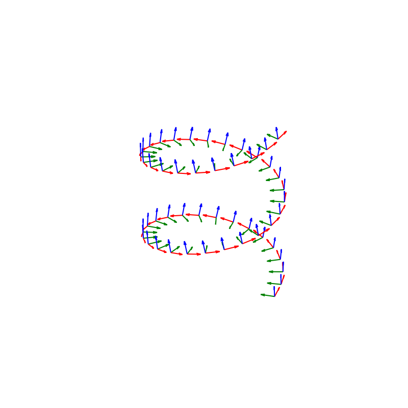
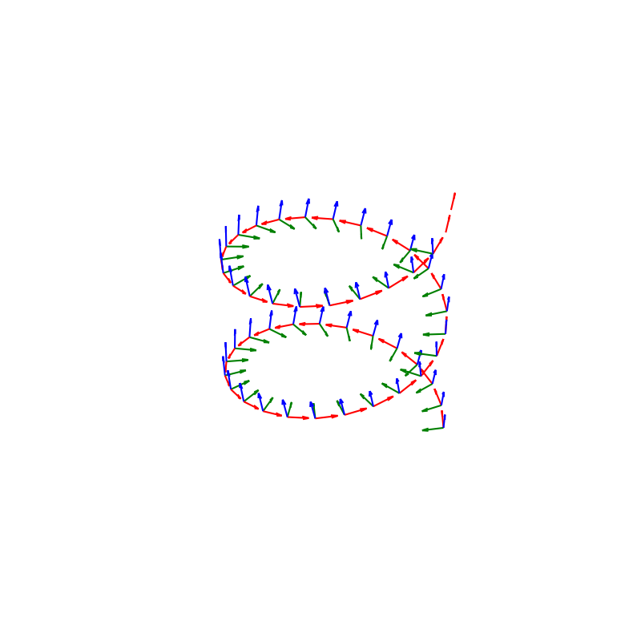

# TNB Frame

### np.gradient

From [Framing Parametric Curves](https://janakiev.com/blog/framing-parametric-curves/)

Could write this way, not unique:

$$\vec{T}=\frac{\vec{x}^{\prime}(t)}{\left\|\vec{x}^{\prime}(t)\right\|} $$

$$\vec{B}=\frac{\vec{x}^{\prime}(t) \times \vec{x}^{\prime \prime}(t)}{\left\|\vec{x}^{\prime}(t) \times \vec{x}^{\prime \prime}(t)\right\|} $$

$$\vec{N}=\vec{B} \times \vec{T} $$


```
#!/usr/bin/env python3

import numpy as np
import matplotlib.pyplot as plt
import matplotlib as mpl


n = 50
t = np.linspace(0, 4 * np.pi, n )

xs = 10 * np.cos(t)
ys = 10 * np.sin(t)
zs = 2 * t


points = np.zeros((n, 3))
points[:, 0] = xs
points[:, 1] = ys
points[:, 2] = zs


# Calculate the first and second derivative of the points
dX = np.apply_along_axis(np.gradient, axis=0, arr=points)
ddX = np.apply_along_axis(np.gradient, axis=0, arr=dX)


# Normalize all tangents 
f = lambda m : m / np.linalg.norm(m)
T = np.apply_along_axis(f, axis=1, arr=dX)
N = np.apply_along_axis(f, axis=1, arr = ddX)

# Calculate and normalize all binormals
B = np.cross(dX, ddX)
B = np.apply_along_axis(f, axis=1, arr=B)


print(np.linalg.norm(B, axis=1))
print(np.linalg.norm(T, axis=1))
print(np.linalg.norm(N, axis=1))

# draw the curve 
fig = plt.figure(figsize=(8,8))

ax = fig.add_subplot(111, projection='3d')
#ax.view_init(vertical_axis='y', elev=30, azim=135)
ax.set_aspect('equal')


for i in range(len(points)):
	x, y, z = points[i]
	nx, ny, nz = N[i]
	bx, by, bz = B[i]
	tx, ty, tz = T[i]
	ax.quiver(x, y, z, tx, ty, tz, length = 2, color = 'red')
	ax.quiver(x, y, z, nx, ny, nz, length = 2, color = 'green')
	ax.quiver(x, y, z, bx, by, bz, length = 2, color = 'blue')

plt.axis('off')
plt.axis('equal')
plt.show()
```




### fem tangents

```
#!/usr/bin/env python3

import numpy as np
import matplotlib.pyplot as plt
import matplotlib as mpl


n = 50
t = np.linspace(0, 4 * np.pi, n )

xs = 10 * np.cos(t)
ys = 10 * np.sin(t)
zs = 2 * t


points = np.zeros((n, 3))
points[:, 0] = xs
points[:, 1] = ys
points[:, 2] = zs


def normalize(v):
	norm=np.linalg.norm(v)
	if norm == 0: return np.array([0, 0, 0])
#	assert norm != 0
	return v/norm

def fem_tangents(points):
	points = np.asarray( points )
	
	
	t = []
	
	for i in range(len(points) - 1):
		t.append( normalize( points[i+1] - points[i] ) )
	
	t.append(t[-1])
	
	return t
		
		


T = fem_tangents(points)
N = fem_tangents(T)


# Calculate and normalize all binormals
B = np.array([normalize( np.cross(t, n) ) for (t, n) in zip(T, N)])

print(np.linalg.norm(T, axis=1))
print(np.linalg.norm(N, axis=1))
print(np.linalg.norm(B, axis=1))


# draw the curve 
fig = plt.figure(figsize=(8,8))

ax = fig.add_subplot(111, projection='3d')
#ax.view_init(vertical_axis='y', elev=30, azim=135)
ax.set_aspect('equal')


for i in range(len(points)):
	x, y, z = points[i]
	nx, ny, nz = N[i]
	bx, by, bz = B[i]
	tx, ty, tz = T[i]
	ax.quiver(x, y, z, tx, ty, tz, length = 2, color = 'red')
	ax.quiver(x, y, z, nx, ny, nz, length = 2, color = 'green')
	ax.quiver(x, y, z, bx, by, bz, length = 2, color = 'blue')

plt.axis('off')
plt.axis('equal')
plt.show()
```



Missing the N, B on the last 2 segment, understandable.