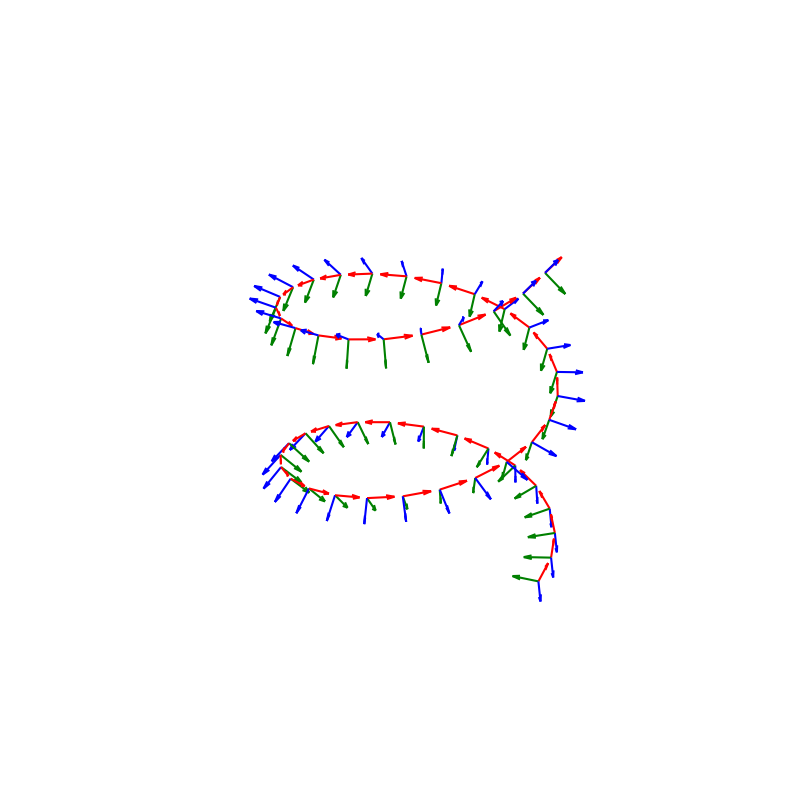

# Parallel Transport

[Parallel Transport Approach to Curve Framing](https://legacy.cs.indiana.edu/ftp/techreports/TR425.pdf) Section 3


```
import numpy as np

from scipy.spatial.transform import Rotation as R
import matplotlib.pyplot as plt

def normalize(v):
	norm=np.linalg.norm(v)
	assert norm != 0
	return v/norm

def generate_helix_points(n = 50):
	
	t = np.linspace(0, 4 * np.pi, n )
	
	xs = 10 * np.cos(t)
	ys = 10 * np.sin(t)
	zs = 2 * t
	
	
	points = np.zeros((n, 3))
	
	points[:, 0] = xs
	points[:, 1] = ys
	points[:, 2] = zs
	
	return points


def orthogonal( v ):
	'''
	'''
	v = np.asarray( v )
	
	mini = 0
	
	if np.abs(v[1]) < np.abs(v[mini]):
		mini = 1
	if np.abs( v[2] ) < np.abs( v[mini]):
		mini = 2
		
	other = np.array([0, 0, 0])
	other[mini] = 1
	
	return np.cross(v, other )


def fem_tangents( points ):
	'''
	forward finite difference to calculate tangents	
	Given :	
		points
	Return:
		tangents
	'''
	
	points = np.asarray( points )
	
	t = []
	for i in range(len(points) -1 ):
		t.append( (points[i+1] - points[i]) / np.linalg.norm(points[i+1] - points[i]) )
	t.append( t[-1] )
	
	return t


points = generate_helix_points()

n = len(points)

# Calculate all tangents 
T = np.apply_along_axis(np.gradient, axis=0, arr=points)

# Normalize all tangents
f = lambda m : m / np.linalg.norm(m)
T = np.apply_along_axis(f, axis=1, arr=T)


# could use above T or below T
T = fem_tangents(points)


# Initialize the first parallel-transported normal vector V
V = np.zeros(np.shape(points))
V[0] = normalize( orthogonal(T[0]) )

# Compute the values for V for each tangential vector from T
for i in range(n - 1):
	b = np.cross(T[i], T[i + 1])
	if np.linalg.norm(b) < 0.00001:
		V[i + 1] = V[i]
	else:
		b = normalize( b )
		phi = np.arccos(np.clip(np.dot(T[i], T[i + 1]), -1, 1))
		r = R.from_rotvec( phi * b )
		V[i + 1] = r.apply(V[i])


		
# Calculate the second parallel-transported normal vector U
U = np.array([np.cross(t, v) for (t, v) in zip(T, V)])


# draw the curve 
fig = plt.figure(figsize=(8,8))

ax = fig.add_subplot(111, projection='3d')
#ax.view_init(vertical_axis='y', elev=30, azim=135)
ax.set_aspect('equal')


#ax.plot(xs, ys, zs)


for i in range(len(points)):
	x, y, z = points[i]
	nx, ny, nz = U[i]
	bx, by, bz = V[i]
	tx, ty, tz = T[i]
	
#	print(bx, by, bz, sep = '\n')
	ax.quiver(x, y, z, tx, ty, tz, length = 2, color = 'red')
	ax.quiver(x, y, z, nx, ny, nz, length = 2, color = 'green')
	ax.quiver(x, y, z, bx, by, bz, length = 2, color = 'blue')
	


plt.axis('off')
plt.axis('equal')
plt.show()
```



